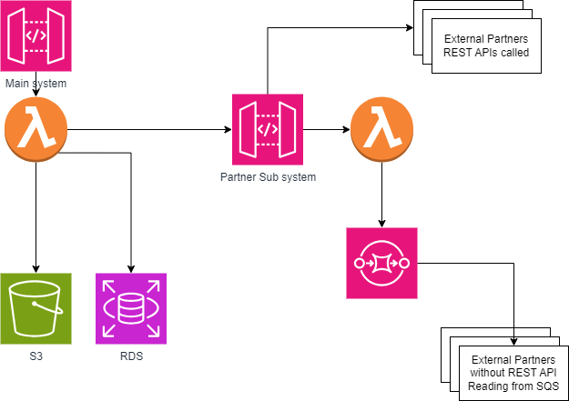

# Partnet API - Solution Design and Architecture Document

## Table of Contents
1. **Introduction**
   - 1.1 Purpose
   - 1.2 Scope
   - 1.3 Definitions, Acronyms, and Abbreviations
   - 1.4 References

2. **System Overview**
   - 2.1 Main System
   - 2.2 Partner Integration
   - 2.3 Data Flow

3. **Architectural Design**
   - 3.1 Microservices Architecture
   - 3.2 Cloud Provider Selection
   - 3.3 API Gateway
   - 3.4 Data Storage
   - 3.5 Communication Protocols

4. **Scalability**
   - 4.1 Horizontal Scaling
   - 4.2 Vertical Scaling
   - 4.3 Auto-scaling

5. **Reliability**
   - 5.1 Redundancy
   - 5.2 Disaster Recovery
   - 5.3 Monitoring and Logging

6. **Cost Optimization**
   - 6.1 Resource Management
   - 6.2 Pay-as-you-go Model
   - 6.3 Reserved Instances

7. **Ease of Maintenance**
   - 7.1 Continuous Integration/Continuous Deployment (CI/CD)
   - 7.2 Version Control
   - 7.3 Containerization

8. **Ease of Operation Management**
   - 8.1 Infrastructure as Code (IaC)
   - 8.2 Automation
   - 8.3 System Health Checks

## 1. Introduction

### 1.1 Purpose
The purpose of this document is to provide a detailed software solution design and architecture for a system that sends data from the main system to multiple partners, considering scalability, reliability, cost, ease of maintenance, and ease of operation management.

### 1.2 Scope
This document outlines the architectural decisions and technologies to be used in implementing the solution. It covers the integration of partners with and without APIs, data flow, and the overall system architecture.

### 1.3 Definitions, Acronyms, and Abbreviations
- API: Application Programming Interface
- AWS: Amazon Web Services
- CI/CD: Continuous Integration/Continuous Deployment
- IaC: Infrastructure as Code

### 1.4 References
- AWS Documentation
- Industry best practices for cloud-based architectures

## 2. System Overview

### 2.1 Main System
The main system serves as the source of data. It will be responsible for producing data that needs to be sent to the integrated partners.

### 2.2 Partner Integration
Partners can either have APIs or integrate with an API provided by our system. Integration changes for a partner occur at most once a year.

### 2.3 Data Flow
Data flows from the main system to the integrated partners. The architecture must handle data transformation and delivery efficiently.

## 3. Architectural Design

### 3.1 Microservices Architecture
The system will be designed as a set of microservices to ensure modularity, ease of development, and independent scaling.

### 3.2 Cloud Provider Selection
AWS will be the chosen cloud provider due to its comprehensive services and scalability options. This includes services like Amazon EC2, Lambda, S3, and RDS.

### 3.3 API Gateway
An API Gateway will be implemented to manage and secure the APIs. AWS API Gateway will be used for its features like rate limiting, caching, and security.

### 3.4 Data Storage
Amazon S3 will be used for scalable and cost-effective storage of data. For relational data, Amazon RDS can be employed.

### 3.5 Communication Protocols
RESTful APIs will be used for partner integration. For partners without APIs, a message broker like Amazon Simple Queue Service (SQS) can be utilized.

## 4. Scalability

### 4.1 Horizontal Scaling
Microservices will be designed to scale horizontally. Load balancers will distribute incoming traffic across multiple instances.

### 4.2 Vertical Scaling
For services that require more resources, vertical scaling will be applied using larger instances or more powerful compute resources.

### 4.3 Auto-scaling
Auto-scaling groups will be configured to dynamically adjust the number of instances based on traffic patterns, ensuring optimal resource utilization.

## 5. Reliability

### 5.1 Redundancy
Services will be deployed across multiple availability zones to ensure redundancy and high availability.

### 5.2 Disaster Recovery
Regular backups of data will be taken, and a disaster recovery plan will be in place, utilizing AWS backup and recovery services.

### 5.3 Monitoring and Logging
AWS CloudWatch will be used for monitoring system metrics, logs, and setting up alarms for proactive issue identification.

## 6. Cost Optimization

### 6.1 Resource Management
AWS Cost Explorer and AWS Trusted Advisor will be employed for monitoring and managing resource usage, optimizing costs.

### 6.2 Pay-as-you-go Model
Utilizing AWS's pay-as-you-go pricing model, costs will align with actual resource consumption.

### 6.3 Reserved Instances
For services with predictable usage, reserved instances can be employed to reduce costs.

## 7. Ease of Maintenance

### 7.1 CI/CD
Implementing CI/CD pipelines using AWS CodePipeline and AWS CodeBuild for automated testing, building, and deployment.

### 7.2 Version Control
Utilizing version control systems like Git for managing source code versions and changes.

### 7.3 Containerization
Docker containers will be used for packaging and deploying microservices, ensuring consistency across development and production environments.

## 8. Ease of Operation Management

### 8.1 IaC
Infrastructure as Code using AWS CloudFormation or Terraform to manage and provision infrastructure.

### 8.2 Automation
Automating routine operational tasks using AWS Lambda or other serverless computing solutions.

### 8.3 System Health Checks
Implementing health checks and automated monitoring to ensure the system's continuous availability and performance.

This software solution design and architecture aim to deliver a scalable, reliable, cost-efficient, and easily maintainable system for sending data to multiple partners. The choice of AWS as a cloud provider ensures access to a wide range of services suitable for the specified requirements.
